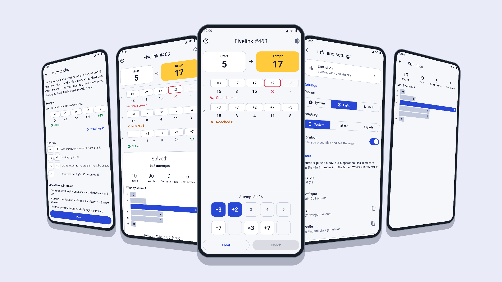
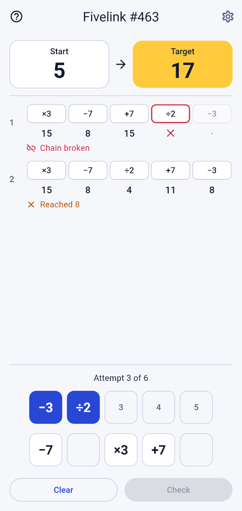
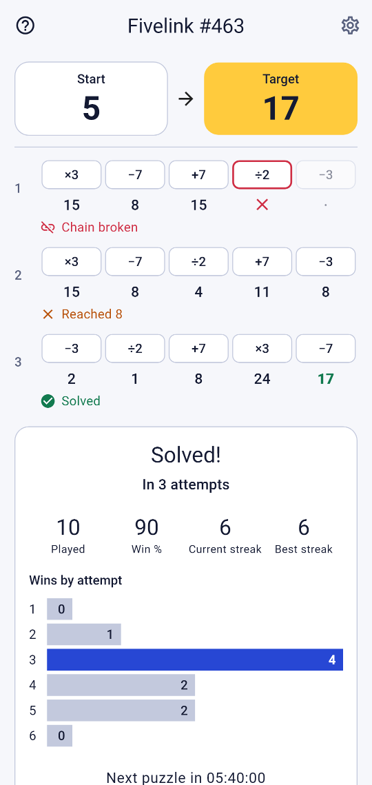
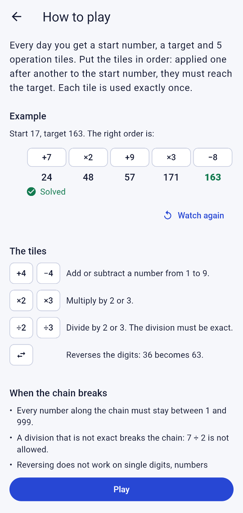
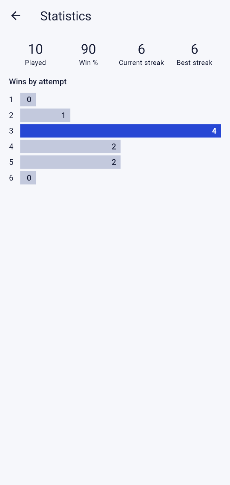
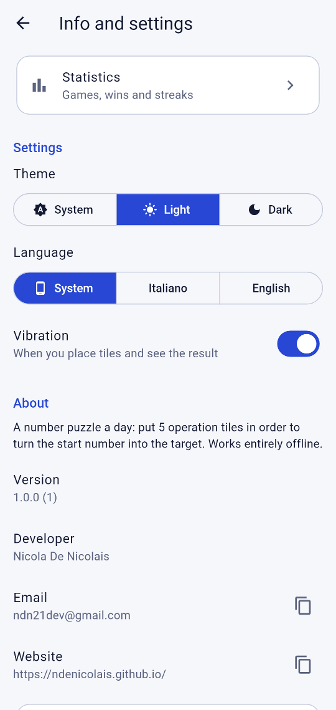

<div align="center">


# Fivelink

**A daily number puzzle for Android, built with Flutter.**

Put 5 operation tiles in order to turn the start number into the target, with 6 attempts and a chain of clues.<br>
A new puzzle every day, the same for everyone, entirely offline, in English and Italian, with light and dark theme.

[](#requirements)
[](https://flutter.dev)
[](LICENSE)

[**📥 Download**](#download) · [Features](#features) · [Documentation](DOCUMENTATION.md) · [Privacy](PRIVACY.md)

<br>



</div>

---

## Screenshots

| Game | Solved | How to play | Statistics | Settings |
|:---:|:---:|:---:|:---:|:---:|
|  |  |  |  |  |

---

## Features

| | |
|---|---|
| 🧩 **Daily puzzle** | A new puzzle every day at midnight, the same on every device, with exactly one solution |
| 🔗 **Chain of clues** | Every attempt shows each intermediate value, up to the result or the step where the chain breaks |
| 🎯 **Six attempts** | Tap tiles into the slots, check the order, never submit the same order twice |
| 📊 **Statistics** | Games played, win rate, current and best streak, wins by attempt |
| 📤 **Share** | Share your result as emoji squares without spoiling the solution |
| 💾 **Resume** | The game of the day is saved after every attempt and restored when you come back |
| ❓ **Guide** | How to play on first launch, with an animated example |
| 🌍 **Multilingual** | English and Italian, following the device or chosen in the settings |
| 🌗 **Theme** | System / Light / Dark theme |
| 📳 **Vibration** | Optional haptic feedback on tiles and results |
| ♿ **Accessibility** | Screen reader labels, large text support, states never shown by color alone |
| 🔐 **Privacy** | Fully offline: no account, no ads, no analytics, no permissions |

---

## Download


Fivelink will be available on the Google Play Store. It needs Android 7.0 or later.

---

## Architecture

| Layer | Technology |
|---|---|
| Framework | Flutter 3 / Dart |
| State management | `ChangeNotifier` + `ListenableBuilder` (no packages) |
| Game logic | Pure Dart in `lib/core/`, no Flutter imports |
| Puzzle generation | Deterministic xorshift32 generator seeded by the date |
| Local persistence | SharedPreferences (versioned JSON keys) |
| Localization | `flutter_localizations` + `intl`, ARB files with gen-l10n |
| Sharing | share_plus |
| Fonts | Roboto (Material default) |
| Icons | Material Icons |

<details>
<summary><b>Project structure</b></summary>

```
lib/
├── main.dart                  # Entry point, loads SharedPreferences
├── app.dart                   # MaterialApp, theme and language from the settings
├── app_theme.dart             # Color schemes and game colors
├── app_info.dart              # Version, developer, privacy policy data
├── core/                      # Pure Dart game logic
│   ├── prng.dart              # xorshift32
│   ├── operation.dart         # Tiles and how they apply to a value
│   ├── chain.dart             # Chain evaluation and break point
│   ├── puzzle.dart            # Puzzle model and attempt outcome
│   ├── puzzle_generator.dart  # Daily puzzle generation (frozen)
│   └── daily.dart             # Date, puzzle number, injectable clock
├── data/                      # Models, storage, settings controller
├── game/                      # Game controller, screen, widgets, share text
├── help/                      # How to play
├── info/                      # Info and settings, privacy policy
├── stats/                     # Statistics view and screen
└── l10n/                      # ARB localization files (en, it)
```

</details>

---

## Build from source

### Requirements

- Flutter SDK 3.44 or later (Dart SDK 3.12.2 or later)
- Android 7.0+ (API 24+)
- No internet connection or external services needed

### Run

```bash
# Clone the repository
git clone https://github.com/ndenicolais/Fivelink.git
cd Fivelink

# Install dependencies
flutter pub get

# Run the app
flutter run
```

Release builds are signed with the keystore set in `android/key.properties` (see [DOCUMENTATION.md](DOCUMENTATION.md)); without it, they fall back to the debug key.

---

## Documentation

For detailed documentation of the game rules, puzzle generation, data model, screens and technical choices, see [DOCUMENTATION.md](DOCUMENTATION.md). How data is handled is described in the [privacy policy](PRIVACY.md).

---

## License

Copyright © 2026 Nicola De Nicolais — All rights reserved.
Released under a **source-available, non-commercial** license — see [LICENSE](LICENSE) for details.
Commercial use, including publishing on any app store, requires the author's written permission.

<div align="center">

Made by **Nicola De Nicolais** · [ndn21dev@gmail.com](mailto:ndn21dev@gmail.com) · [GitHub](https://github.com/ndenicolais)

</div>
